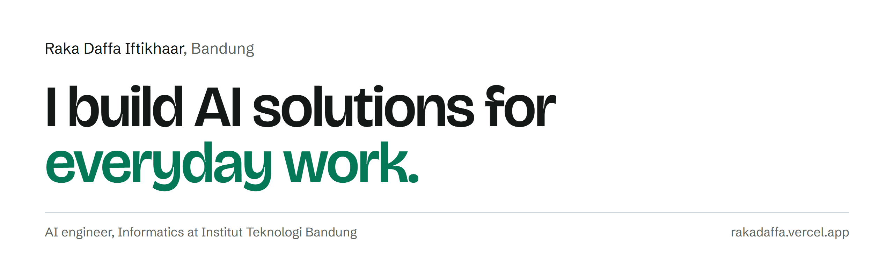
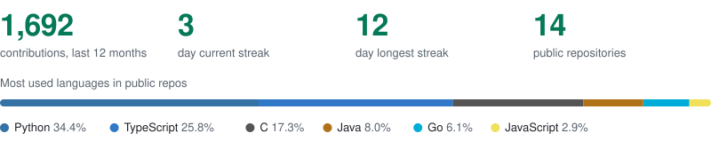

<picture>
  <source media="(prefers-color-scheme: dark)" srcset="assets/banner-dark.png">
  
</picture>

I'm an AI engineer and Informatics student at Institut Teknologi Bandung. I take AI features from idea to something people can use: the data, the model, the evaluation, and the app around it.

## What I work on

- **LLM applications.** Search and chat over company documents with retrieval, and agents that automate multi-step workflows.
- **Machine learning models.** Forecasting and classification on real, messy data, with evaluation that holds up outside the notebook.
- **Getting it to users.** APIs, dashboards, and pipelines, so a model ends up in someone's hands.

Three national data science podiums in 2026, two of them first place.

## GitHub

## Tools I use

**Languages** 
&nbsp; &nbsp; &nbsp; &nbsp; &nbsp; &nbsp; 

**AI and LLMs** 
&nbsp; &nbsp; &nbsp; &nbsp; &nbsp; &nbsp; 

**ML and data** 
&nbsp; &nbsp; &nbsp; &nbsp; &nbsp; 

**Web and tools** 
&nbsp; &nbsp; &nbsp; &nbsp; &nbsp; &nbsp; &nbsp; 

[Portfolio](https://rakadaffa.vercel.app) · [LinkedIn](https://www.linkedin.com/in/rakadaffa) · [Email](mailto:raka.daffa2005@gmail.com)
