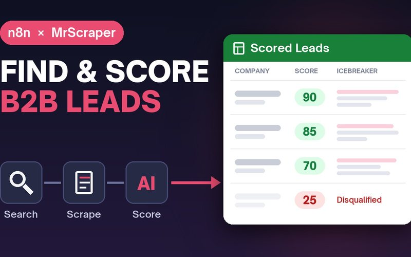
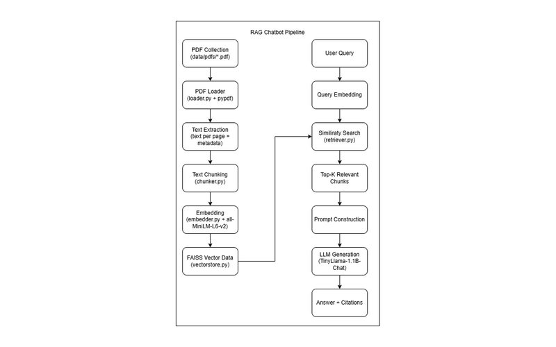
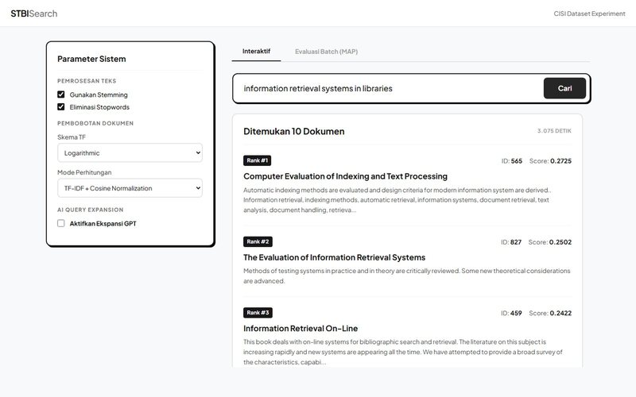
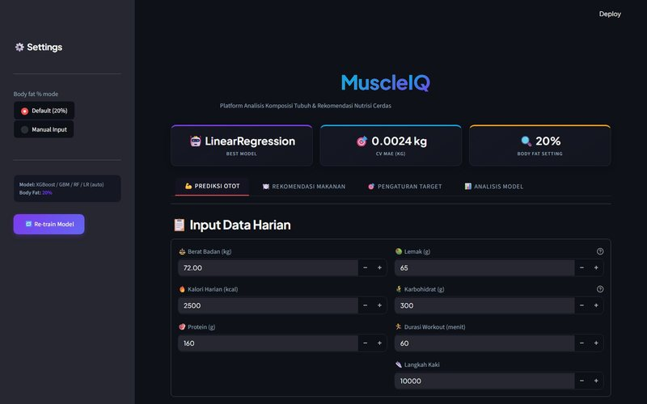
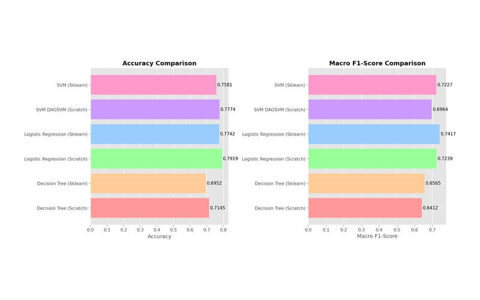

<picture>
  <source media="(prefers-color-scheme: dark)" srcset="assets/banner-dark.png">
  
</picture>

I'm an AI engineer and Informatics student at Institut Teknologi Bandung. I work with machine learning and language models, mostly on problems that come up in everyday work.

[Portfolio](https://rakadaffa.vercel.app) · [LinkedIn](https://www.linkedin.com/in/rakadaffa) · [Email](mailto:raka.daffa2005@gmail.com)

## Selected work

<table>
  <tr>
    <td width="50%" valign="top">
      
      <h3><a href="https://n8n.io/workflows/19611">AI Sales Prospecting Agent</a></h3>
      An n8n workflow that finds companies matching a sales team's ideal customer, scores how well each one fits, and drafts a personal opening line. Published in the official n8n template library. <a href="https://youtu.be/HXrcmRNDSD4">Demo video</a>.
        n8n · Gemini · MrScraper · Google Sheets
    </td>
    <td width="50%" valign="top">
      
      <h3><a href="https://github.com/rakdaf08/nolimit-ds-test-rakadaffa">PDF Question Answering</a></h3>
      A chatbot that answers questions using a folder of PDF documents as its only source, and points to the pages each answer came from.
        Python · FAISS · Sentence Transformers · Streamlit
    </td>
  </tr>
  <tr>
    <td width="50%" valign="top">
      
      <h3><a href="https://github.com/rakdaf08/query-expansion-gpt">Search with Query Expansion</a></h3>
      A search engine for a research library collection. A language model adds related terms to each query, and the app measures whether that makes results better.
        Python · Flask · OpenAI API · NLTK
    </td>
    <td width="50%" valign="top">
      
      <h3><a href="https://github.com/rakdaf08/muscle-nutrition-prediction">MuscleIQ</a></h3>
      Estimates muscle mass from daily food and training logs, sets calorie and protein targets, and suggests foods that fit them.
        Python · scikit-learn · Streamlit
    </td>
  </tr>
  <tr>
    <td width="50%" valign="top">
      
      <h3><a href="https://github.com/rakdaf08/Tubes2AI">Machine Learning from Scratch</a></h3>
      Three classic models written by hand in NumPy, used to predict whether students graduate, stay enrolled, or drop out, and compared with scikit-learn on the same data.
        Python · NumPy · scikit-learn
    </td>
    <td width="50%" valign="top">
      <h3><a href="https://rakadaffa.vercel.app/#projects">More on my portfolio →</a></h3>
      Screenshots, write-ups, and the rest of my projects live at <a href="https://rakadaffa.vercel.app">rakadaffa.vercel.app</a>.
    </td>
  </tr>
</table>

## Competitions

| Place | Competition | Organizer | Year |
|:-:|---|---|:-:|
| **1st** | Data Mining Competition, UNITY #14 | Universitas Negeri Yogyakarta | 2026 |
| **1st** | Data Science Competition, IN-FEST | Universitas PGRI Semarang | 2026 |
| **2nd** | Data Science Competition, GAMMAFEST | IPB University | 2026 |

## Tools I use

**Languages** 
&nbsp; &nbsp; &nbsp; &nbsp; &nbsp; &nbsp; 

**AI and LLMs** 
&nbsp; &nbsp; &nbsp; &nbsp; &nbsp; &nbsp; 

**ML and data** 
&nbsp; &nbsp; &nbsp; &nbsp; &nbsp; 

**Web and tools** 
&nbsp; &nbsp; &nbsp; &nbsp; &nbsp; &nbsp; &nbsp; 

Open to AI and ML engineering roles.
